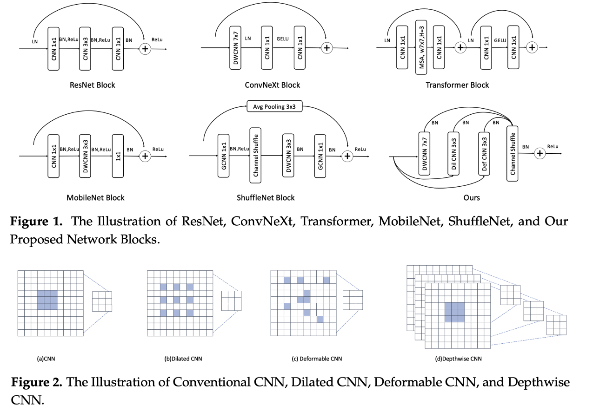

# InceptionUNeXt
Crafting a Lightweight and Robust Symmetrical Network for Enhanced Biomedical Image Segmentation.


## Motivation

Exploring Dilated CNN, Deformable CNN, and Depthwise CNN for medical image segmentation.

## Requirements
* Pytorch
* Some basic python packages such as Numpy, Scikit-image, SimpleITK, Scipy ......
* More information about environment development can be found in 'environment.yml' file.


## DataSets
We use the Glas dataset originating from Gland Segmentation in Colon Histology Images Challenge from MICCAI Challenge 2015, which you can find more information here [Official](https://arxiv.org/abs/1603.00275).


## Models
We provide many baseline methods as well including UNet, AttentionUNet, LinkNet, ConvUNext, TransUNet, SwinUNet, and UnetLite, which you can be found in '/nn' folder.

We also provide evaluation metrics including Dice-Coefficient, IoU, Accuracy, Precision, Sensitivity, and Specificity, which you can be found in 'metrics,py' file.


## Usage

1. Clone the repo:
```
git clone https://github.com/ziyangwang007/TriConvUNeXt.git
cd TriConvUNeXt
```

2. Train the model

```
python train.py 
```

3. Test the model
```
python val.py 
```

## Reference

Chao Ma, Yuan Gu, Ziyang Wang. "TriConvUNeXt: A Pure CNN-based Lightweight Symmetrical Network for Biomedical Image Segmentation." Journal of Imaging Informatics in Medicine (2024).
